# Multi-LiteLLM-Agent-with-Google-ADK
*A Multi-Agent System using Google ADK + LiteLLM*

This project builds a structured **multi-agent system** using [Google ADK](https://github.com/google/adk-python), designed to automate the workflow of stock market research and generate professional social media content using LLM agents via `LiteLLM`.

---

## 🔍 What It Does

This assistant performs:

1. **Market Research**: Identifies trending and profitable stocks using real-time web search.
2. **Financial Analysis**: Applies technical indicators and analysis logic.
3. **Investment Justification**: Builds detailed investment theses.
4. **Social Media Marketing**: Creates content for LinkedIn & Instagram.
5. **Campaign Coordination**: Synchronizes messaging and engagement.
6. **Report Generation**: Compiles everything into a markdown-formatted final report.

---

## 🧠 Agent Logic & Flow

This system uses **Sequential** and **Parallel** agent orchestration provided by Google ADK.

### 📂 Agent List & Responsibilities

| Agent Name | Type | Role |
|------------|------|------|
| `StockDataCollector` | `LlmAgent` | Uses web tools to collect data on top-performing stocks. |
| `TechnicalAnalyst` | `LlmAgent` | Analyzes trends and identifies investment-worthy stocks. |
| `InvestmentThesisGenerator` | `LlmAgent` | Creates persuasive investment arguments for selected stocks. |
| `LinkedInContentCreator` | `LlmAgent` | Generates professional LinkedIn posts. |
| `InstagramContentCreator` | `LlmAgent` | Creates engaging Instagram content. |
| `SocialMediaCoordinator` | `LlmAgent` | Merges, schedules, and aligns posts for both platforms. |
| `FinalReportGenerator` | `LlmAgent` | Compiles the entire output into a final report. |

### 🔄 Execution Flow

```mermaid
graph TD
    A[StockDataCollector 📊] --> B[TechnicalAnalyst 📈]
    B --> C[InvestmentThesisGenerator 💡]
    C --> D[LinkedInContentCreator 💼]
    C --> E[InstagramContentCreator📸]
    D & E --> F[SocialMediaCoordinator 🧩]
    F --> G[FinalReportGenerator 📝]
```



- **Sequential Flow**: The first 3 agents pass data to one another in order.
- **Parallel Execution**: LinkedIn and Instagram agents run concurrently.
- **Finalization**: Social media content is combined, then compiled into a markdown report.

### 📦 Root Agent (`root_agent`)
This is the top-level orchestrator. It initializes a `SequentialAgent` named `StockAnalysisAndSocialMediaAssistant` that drives the flow above.

Defined in `agent.py`:
```python
root_agent = stock_social_orchestrator
result = root_agent.run()
```

---

## 🧱 Project Structure

```
.
├── Virtual env                  # create a new Virtual Environment to install requirements.txt
├── multi_agent                  # Folder in which (agent.py, instructions.py, __init__.py, .eve) is stored
 ├── agent.py                    # All agent definitions + orchestration logic
 ├── instructions.py             # Detailed instructions/prompts for each agent
 ├── .env                        # Environment config (e.g., API key, model name)
 ├── __init__.py                 # Package init file
├── requirements.txt             # Dependencies
```

---

## ⚙️ Setup Instructions

### 1. Clone the repository
```bash
git clone <your-repo-url>
cd <project-directory>
```
### 2. Create a new environment 
Create a new environment in your project folder to run requirements.txt

```bash
-path python -m venv <environment_name>
-path\<environment_name>\Scripts\activate
```

### 3. Install dependencies
```bash
pip install -r requirements.txt
```

### 4. Configure your environment
Create a `.env` file (already included):
```env
GOOGLE_API_KEY=your_google_api_key
GOOGLE_GENAI_MODEL=gemini-2.0-flash
GOOGLE_GENAI_USE_VERTEXAI=FALSE
```

---

## 🧪 Run the Agent System

In a Jupyter Notebook:
```python
from multi_agent.agent import root_agent
output = root_agent.run()
print(output)
```

Or, using a standalone script:
```python
from multi_agent.agent import root_agent

if __name__ == "__main__":
    result = root_agent.run()
    print(result)
```

---

## ✅ Output

The system generates:

- A markdown-formatted **investment report**
- Structured **technical analysis**
- Personalized **LinkedIn & Instagram posts**
- A **posting calendar** with engagement strategies

---

## 🔧 Requirements

- Python ≥ 3.9
- `google-adk`
- `google-generativeai`
- `litellm`
- `python-dotenv`
- `pydantic`

---

## 💡 Future Improvements

- Integration with Twitter or Discord
- Scheduled auto-posting via APIs
- Real-time stock API integration (e.g., Alpha Vantage)
- GUI dashboard for non-developers

---

## 📜 License
